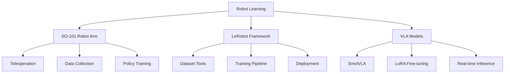

# 👋 Hi, I'm Jiaxuan Wang (王嘉璇)

**Robotics Engineer & Researcher | VLA Models | Robot Learning | Computer Vision**

## 🚀 About Me

I'm a third-year undergraduate student at **Huazhong University of Science and Technology** and the **Team Leader of Dian Team's Robotics Group**. My passion lies in robotics, artificial intelligence, and computer vision.

- 🔭 I'm currently working on **SO-101 Robot Arm System**, **LeRobot Framework**, and **VLA Model Fine-tuning**
- 🌱 I'm currently learning **Advanced Robot Learning**, **Vision-Language-Action Models**, and **Real-time Control Systems**
- 👯 I'm looking to collaborate on **Open Source Robotics Projects** and **Research Publications**
- 💬 Ask me about **Robot Learning**, **PyTorch**, **Computer Vision**, and **Robot Control**
- 📫 How to reach me: **1905185430@qq.com**
- ⚡ Fun fact: I can control robot arms with just my mind... and some Python code! 🤖

## 🛠️ Skills & Tools

### Programming Languages

### Robotics & AI

### Tools & Platforms

## 🔥 Featured Projects

### 🤖 SO-101 Robot Arm System
A comprehensive system for SO-101 dual-arm robot control, data collection, and model deployment.

**Technologies:** Python, LeRobot, PyTorch, OpenCV  
**Status:** 🚀 Active Development  
**GitHub:** [so101](https://github.com/1905185430/so101)

### 🧠 LeRobot Framework Contributions
Contributions to HuggingFace's LeRobot framework for robot learning.

**Technologies:** Python, PyTorch, HuggingFace  
**Status:** ✅ Completed  
**GitHub:** [lerobot_workdocs](https://github.com/1905185430/lerobot_workdocs)

### 🎯 VLA Model Fine-tuning Pipeline
Tools and pipelines for fine-tuning Vision-Language-Action models.

**Technologies:** Python, PyTorch, Transformers  
**Status:** 🚀 Active Development  
**GitHub:** [vla-finetune](https://github.com/1905185430/vla-finetune)

## 📊 GitHub Stats

## 📈 GitHub Activity Graph

## 🏆 GitHub Trophies

## 📝 Latest Blog Posts

<!-- BLOG-POST-LIST:START -->
- [Welcome to My Technical Blog](https://1905185430.github.io/blog/2026/04/26/welcome-to-my-website/)
- [SO-101 Robot Arm System Overview](https://1905185430.github.io/blog/2026/04/26/so101-overview/)
- [VLA Model Fine-tuning Guide](https://1905185430.github.io/blog/2026/04/26/vla-finetuning-guide/)
<!-- BLOG-POST-LIST:END -->

➡️ [more blog posts...](https://1905185430.github.io/blog)

## 🎯 Current Focus

## 🤝 Let's Connect

## 📚 Publications & Achievements

- 🎓 **ICTC Conference**: Paper on "Intelligent Application Design of Chemical Experiment Robotic Arm Based on Imitation Learning"
- 🎓 **ROBIO Conference**: Paper submitted (CCF-C)
- 🏆 **Dian Team Outstanding Member**: 2025
- 🏆 **Academic Excellence Award**: 2024

## 💡 Fun Facts

- 🤖 I've collected over **100 episodes** of robot demonstration data
- 🧠 I've trained **5+ different VLA models** for robotic tasks
- 📝 I've written **50+ pages** of technical documentation
- 🎮 I can control robot arms with **just 3 lines of Python code**
- 🌟 My favorite debugging tool: **print() statements** 😄

## 🎵 Coding Playlist

## 📈 Visitor Count

---

⭐️ From [1905185430](https://github.com/1905185430) | 🤖 **Building the future of robotics, one line of code at a time!**

